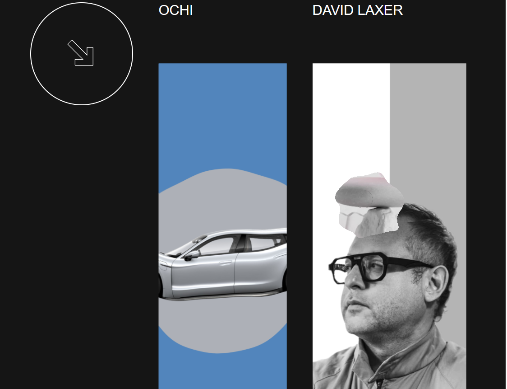
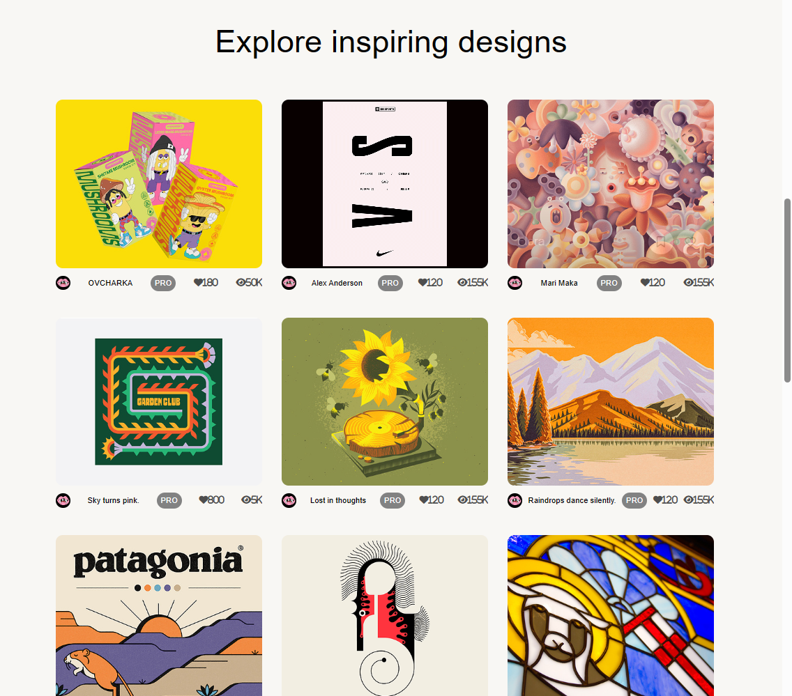
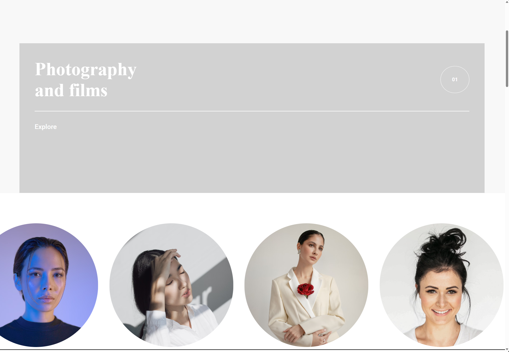
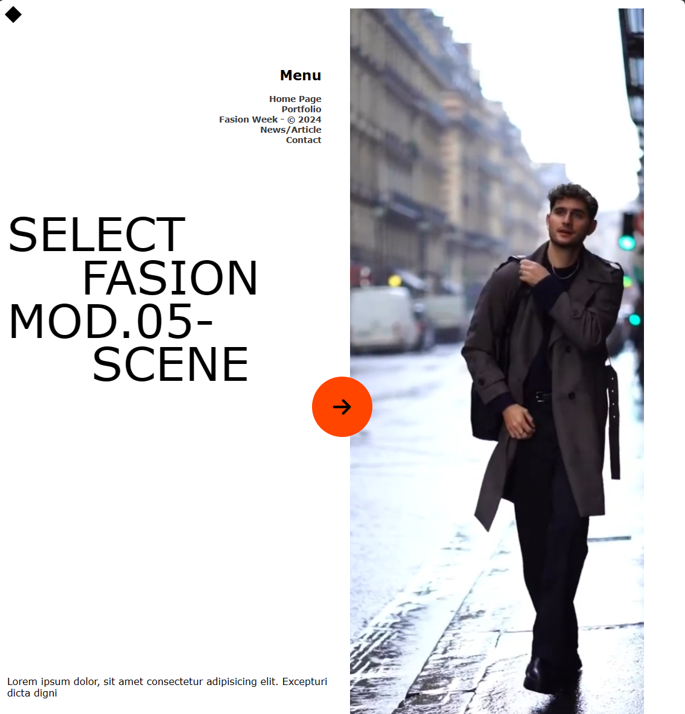
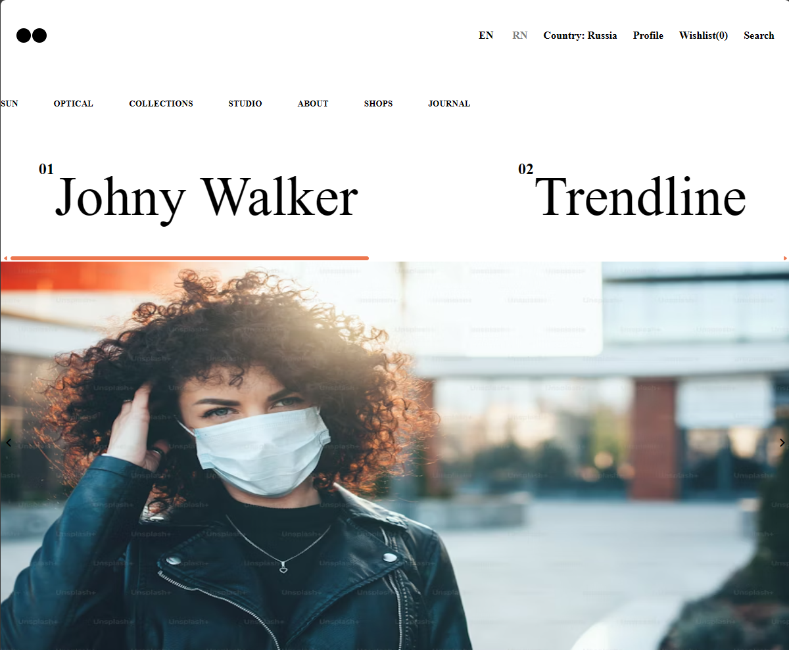
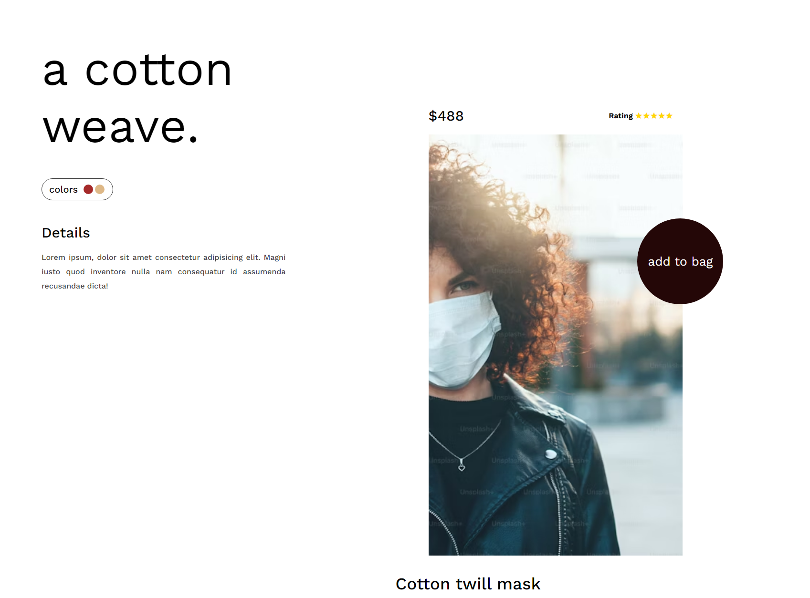
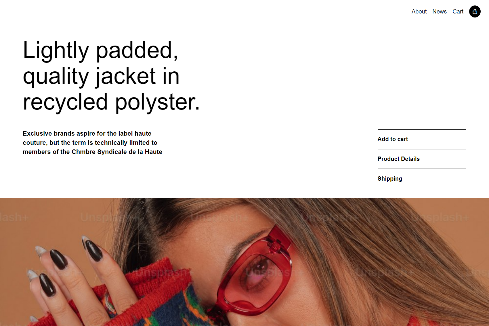

# Landing Page Collection

A curated collection of responsive, high-performance landing pages and website clones. This project demonstrates proficiency in modern frontend web development, focusing on layout precision, interactive animations, and responsive design.

## 🛠 Tech Stack

- **Core**: HTML5, CSS3, JavaScript (ES6+)
- **Animation**: GSAP (GreenSock Animation Platform), ScrollTrigger
- **Scroll**: Locomotive Scroll, Shery.js (for 3D effects)
- **Icons**: Remix Icon
- **Fonts**: Google Fonts

## 🚀 Live Demo

Check out the live version of these projects here:  
**[https://landing-pages-coral.vercel.app/](https://landing-pages-coral.vercel.app/)**

## 📂 Projects

| Project Name         | Live Link                                                                |
| :------------------- | :----------------------------------------------------------------------- |
| **Obys Agency**      | [View Project](https://landing-pages-coral.vercel.app/obys/)             |
| **Dribbble Clone**   | [View Project](https://landing-pages-coral.vercel.app/dribble/)          |
| **Model Management** | [View Project](https://landing-pages-coral.vercel.app/model-management/) |
| **Men's Fashion**    | [View Project](https://landing-pages-coral.vercel.app/mens-fashion/)     |
| **Trendline**        | [View Project](https://landing-pages-coral.vercel.app/trendline/)        |
| **A Cotton Weave**   | [View Project](https://landing-pages-coral.vercel.app/a-cotton-weave/)   |
| **Shop Jacket**      | [View Project](https://landing-pages-coral.vercel.app/shop-jacket/)      |

## 📸 Screenshots

### Obys Agency



### Dribbble Clone



### Model Management



### Men's Fashion



### Trendline



### A Cotton Weave



### Shop Jacket



## 🔧 Installation & Usage

1. **Clone the repository:**

   ```bash
   git clone https://github.com/your-username/landing-pages.git
   ```

2. **Navigate to the project directory:**

   ```bash
   cd landing-pages
   ```

3. **Run locally:**
   Since these are static pages, you can open `index.html` in your browser or use a live server extension (like Live Server in VS Code) to view them.

---

_Created by Ubednama_
